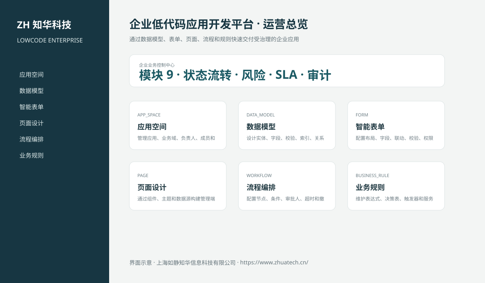
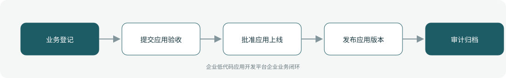

# ZhuaTech LOWCODE｜企业低代码应用开发平台

> 通过数据模型、表单、页面、流程和规则快速交付受治理的企业应用

ZhuaTech LOWCODE 是知华科技（上海如静知华信息科技有限公司）发布的企业级源码项目，面向“应用空间、数据模型、表单、页面、流程、规则、集成、版本、发布与运行治理”提供管理端与响应式业务端。工程采用前后端分离架构，所有示例数据均为虚构数据。

[知华科技官网](https://www.zhuatech.cn/) · [架构说明](docs/ARCHITECTURE.md) · [API 文档](docs/API.md) · [企业能力](docs/ENTERPRISE.md) · [测试说明](docs/TESTING.md)



## 业务模块

| 模块 | 核心能力 |
| --- | --- |
| 应用空间 | 管理应用、业务域、负责人、成员和环境 |
| 数据模型 | 设计实体、字段、校验、索引、关系和数据权限 |
| 智能表单 | 配置布局、字段、联动、校验、权限和移动端适配 |
| 页面设计 | 通过组件、主题和数据源构建管理端与门户页面 |
| 流程编排 | 配置节点、条件、审批人、超时和撤回规则 |
| 业务规则 | 维护表达式、决策表、触发器和服务端校验 |
| 连接器 | 连接API、数据库、消息、文件和企业身份平台 |
| 版本管理 | 保存草稿、差异、依赖、快照和回滚点 |
| 发布治理 | 执行安全、权限、性能、命名和上线门禁 |



## 专业业务深化

- 应用版本独立保存页面数、流程数、依赖、覆盖率、安全、权限和回滚快照状态；
- 发布门禁同时校验页面、模型错误、连接器依赖、测试覆盖率、安全问题和责任人；
- 应用版本经过提交验收和管理员发布，发布新版本时自动归档同应用旧版本；
- 每个版本保存不可变 `SHA-256` 制品摘要，并严格执行 `DEV → TEST → PRODUCTION` 晋级；摘要漂移或未晋级 TEST 的版本不能提交；
- 已发布版本可按已生成快照执行审计留痕的受控回退。

## 企业级控制

- ADMIN / OPERATOR 角色边界和管理员接口隔离；
- 服务端字段、模块、唯一编号和状态迁移校验；
- 组织、期间、责任人、风险等级、到期日和 SLA 统计；
- 支持组织/账期隔离查询、治理驾驶舱、办结率、证据缺口与同步失败监控；
- 支持最多 100 条控制项的原子批量提交、管理员批量复核和失败整体回滚；
- 支持组织账期锁定/解锁，锁定后禁止新增、提交、审批、补证和办结；
- 幂等创建、JPA 乐观锁、重复提交保护和职责分离；
- 附件 SHA-256 元数据、业务凭证完整性与全流程审计；
- 组合检索、分页、逾期筛选、UTF-8 CSV 导出和协作时间线；
- 外部系统仅预留适配器，使用方自行配置地址与凭据；
- prod profile 拒绝默认密码、弱数据库口令和本地跨域来源。

## 技术架构

- 后端：Java 21、Spring Boot、Spring Security、JPA、Bean Validation、Actuator
- 前端：Vue 3、Vite、Axios，支持桌面端与移动端响应式布局
- 数据库：MySQL 8；自动化测试使用 H2
- 交付：Docker Compose、Nginx、环境变量、GitHub Actions
- Java 包名：`cn.zhuatech.lowcode`

## 启动与测试

```bash
cd backend && mvn test
cd ../frontend && npm install && npm run build
cd .. && cp .env.example .env && docker compose up --build
```

开发演示账号：`admin / admin123`、`operator / operator123`。生产环境必须通过环境变量替换全部默认凭据。

## 许可与商业授权

Copyright © 2026 上海如静知华信息科技有限公司。

本工程仅允许个人学习、研究和非商业技术交流，**不得用于商业用途**。企业内部使用、生产部署、SaaS运营、项目交付、品牌替换、收费培训、咨询实施或再分发，均须事先获得上海如静知华信息科技有限公司书面授权，详见 [LICENSE](LICENSE)。

深度开发、私有化部署、系统集成与企业数字化咨询，请访问[知华科技官网](https://www.zhuatech.cn/)或扫码联系：

| 微信咨询一 | 微信咨询二 |
| --- | --- |
|  |  |

SEO：企业低代码应用开发平台、LOWCODE系统源码、企业数字化、Java企业系统、Vue管理系统、知华科技、上海如静知华信息科技有限公司。
